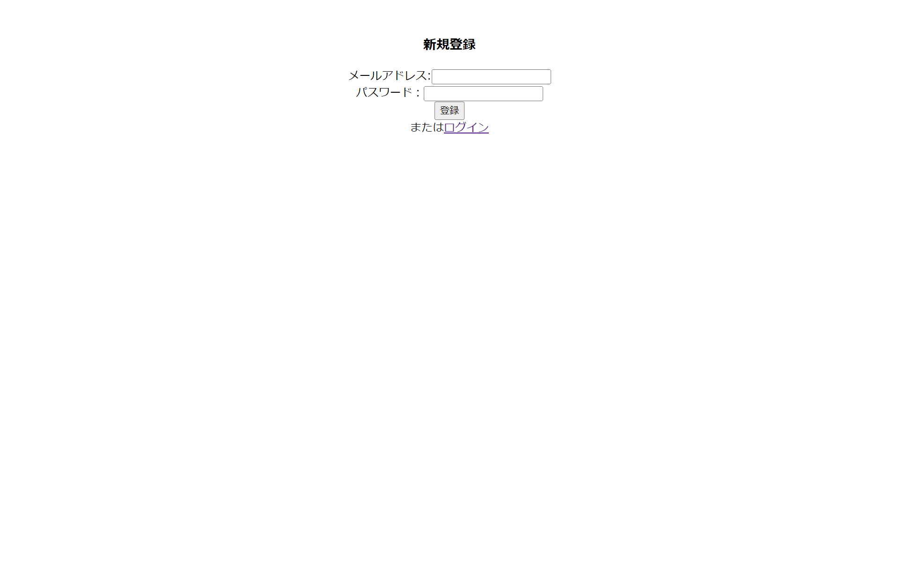

<div id="top"></div>

## 使用技術一覧

<!-- シールド一覧 -->
<!-- 該当するプロジェクトの中から任意のものを選ぶ-->
<p style="display: inline">
  <!-- フロントエンドのフレームワーク一覧 -->
  
  <!-- フロントエンドの言語一覧 -->
  
  <!-- バックエンドのフレームワーク一覧 -->
  
  
  <!-- バックエンドの言語一覧 -->
  
  <!-- ミドルウェア一覧 -->
  
  <!-- インフラ一覧 -->
  
</p>

## 目次

1. [プロジェクトについて](#プロジェクトについて)
2. [環境](#環境)
3. [構成](#構成)
4. [開発環境構築](#開発環境構築)
5. [機能一覧](#機能一覧)
6. [トラブルシューティング](#トラブルシューティング)

<!-- プロジェクト名を記載 -->

## プロジェクト名

Webスクレイピングアプリケーション

<!-- プロジェクトについて -->

## プロジェクトについて

<!-- プロジェクトの概要を記載 -->
Amazonの商品ページのURLを入力すると値段等がスクレイピングされDBに登録されます。  
毎日11:00のバッチ処理時に登録してある商品の最新の値段をDBに保存、登録時の値段と比較し、  
登録時よりも安くなっていた場合、メールピットにその商品の情報を送信します。  
ユーザーはサービス利用時にメールアドレスとパスワードを登録する必要があり、登録商品はユーザーごとに管理されます。  
Dockerを使用し、サーバー、DB初期テーブルを自動作成します。

<p align="right">(<a href="#top">トップへ</a>)</p>

## 環境

<!-- 言語、フレームワーク、ミドルウェア、インフラの一覧とバージョンを記載 -->

| 言語・フレームワーク  | バージョン |
| --------------------- | ---------- |
| Node.js               | 20.16.0    |
| SpringBoot            | 3.3.0      |
| SpringSecurity        | 6.3.0      |
| Java                  | 17.0.2     |
| PostgreSQL            | 16.4       |
| Docker                | 25.0.3     |
| Apache Tomcat         | 9.0.62     |

その他のパッケージのバージョンは package.json を参照してください

<p align="right">(<a href="#top">トップへ</a>)</p>

## 構成

### ディレクトリ

<!-- Treeコマンドを使ってディレクトリ構成を記載 -->

❯ tree -a -I "node_modules|.next|.git|.pytest_cache|static" -L 3
<pre>
.
├── .vscode
│   ├── launch.json
│   └── settings.json
├── README.md
├── demo
│   ├── .gitignore
│   ├── .gradle
│   │   ├── 8.7
│   │   ├── buildOutputCleanup
│   │   ├── file-system.probe
│   │   └── vcs-1
│   ├── .settings
│   │   ├── org.eclipse.buildship.core.prefs
│   │   ├── org.eclipse.wst.common.component
│   │   └── org.eclipse.wst.common.project.facet.core.xml
│   ├── bin
│   │   ├── main
│   │   └── test
│   ├── build
│   │   ├── classes
│   │   ├── generated
│   │   ├── libs
│   │   ├── reports
│   │   ├── resolvedMainClassName
│   │   ├── resources
│   │   ├── test-results
│   │   └── tmp
│   ├── build.gradle
│   ├── docker-compose.yml
│   ├── gradle
│   │   └── wrapper
│   ├── gradlew
│   ├── gradlew.bat
│   ├── init.sql
│   ├── server
│   │   └── Dockerfile
│   ├── settings.gradle
│   ├── sql
│   │   └── ddl_scraping.txt
│   ├── src
│   │   ├── main
│   │   └── test
│   └── web
│       └── Dockerfile
├── img
│   ├── login.png
│   ├── register.png
│   ├── scrape.png
│   └── screen-transition.png
├── package-lock.json
└── package.json
</pre>

### ER図


### 画面遷移図


### シーケンス図


<p align="right">(<a href="#top">トップへ</a>)</p>

## 開発環境構築

<!-- コンテナの作成方法、パッケージのインストール方法など、開発環境構築に必要な情報を記載 -->

### 作成と起動

Ubuntuで以下のコマンドを入力する
```
docker compose -f "docker-compose.ymlの絶対パス" up -d
```

### 動作確認

http://localhost:3000 （サーバー）  
http://localhost:8025 （mailpit）  
http://localhost:8080/toLogin にアクセスできるか確認。

### 環境変数の一覧

| 変数名                 | 役割                                      | デフォルト値                       |
| ---------------------- | ----------------------------------------- | ---------------------------------- |
| MAIL_HOST              | mailpit のホスト名                        | mail                                |
| MAIL_PORT              | mailpit のポート番号                      | 1025                                |
| DB_USER                | PostgreSQL のユーザ名                     | postgres                            |
| DB_PASS                | PostgreSQL のパスワード                   | postgres                            |
| DB_HOST                | PostgreSQL のホスト名                     | db                                  |
| DB_PORT                | PostgreSQL のポート番号                   | 5432                                |
| DB＿NAME               | PostgreSQL のデータベース名                | scraping                            |

<p align="right">(<a href="#top">トップへ</a>)</p>

## 機能一覧
### ログイン画面


メールアドレスとパスワードで、SpringSecurityを使用したログイン認証を行います。  
ログインが失敗した場合はエラーメッセージが表示されます。
  
### 新規登録画面


メールアドレスは重複不可です。 
不備がある場合はエラーメッセージが表示されます。

### URL入力画面


上部にURLを入力するテキストボックス、下部に登録した商品の一覧が表示されます。  
Scrapeボタンを押すとボタンの表記が解析中に変わり、解析中の二重サブミットを防ぎます。  
終了後は結果によって、テキストボックスの下に成功・失敗の文字が表示されます。  
商品の削除やログアウトもこのページで行います。

<p align="right">(<a href="#top">トップへ</a>)</p>

## トラブルシューティング

### ・URL入力後、「解析が失敗しました」と表示される
取得元のデータの構造により、解析ができない商品があります。他の商品を登録してください。

### ・最新価格に「データなし」と表示される
取得元のデータの変化により、最新価格の取得ができなくなる場合があります。削除して新しく登録し直してください。  
また、商品情報を取得した直後から初回のバッチ処理までは全てデータなしと表示されます。


<p align="right">(<a href="#top">トップへ</a>)</p>
